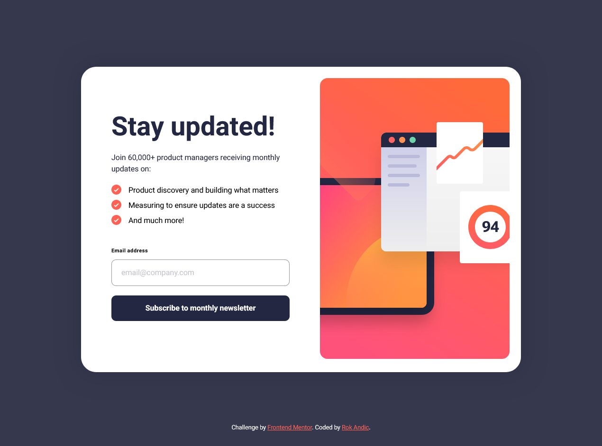

# Frontend Mentor - Newsletter sign-up form with success message solution

This is a solution to the [Newsletter sign-up form with success message challenge on Frontend Mentor](https://www.frontendmentor.io/challenges/newsletter-signup-form-with-success-message-3FC1AZbNrv). Frontend Mentor challenges help you improve your coding skills by building realistic projects.

## Table of contents

- [Overview](#overview)
  - [The challenge](#the-challenge)
  - [Screenshot](#screenshot)
  - [Links](#links)
  - [Built with](#built-with)

## Overview

### The challenge

Users should be able to:

- Add their email and submit the form
- See a success message with their email after successfully submitting the form
- See form validation messages if:
  - The field is left empty
  - The email address is not formatted correctly
- View the optimal layout for the interface depending on their device's screen size
- See hover and focus states for all interactive elements on the page

### Screenshot

### Links

- [Live Site](https://rokandic.github.io/newsletter-sign-up-with-success-message/)

### Built with

- Mobile-first workflow
- CSS modules
- React
- Next.js
- TypeScript

### What I learned

This is my first project using Next.js and TypeScript, so there was quite a lot of small things to figure out. Especially form validation.

I decided to validate myself using JavaScript, since there's only one element to validate, but I learned that if the form would be a bit more complex, it would make more sense to switch to Formik or React Hook Forms.

I spent some time to figure out how to define and work with event types in TypeScript. I tried to avoid using "any" whenever possible and did my best to properly define types and learn more about TypeScript.

Since I also just started using React, I also experimented with how to structure components and tried to make the best use of states. Though I decided to handle form submission in the main parent component, I am still learning about which component is the best place to handle different events.

### Continued development

Form validation could use Formik or React Hook Forms. This is something I plan to learn more about in the future.

Structuring React components in a way that would allow for better re-use in other forms and projects.
